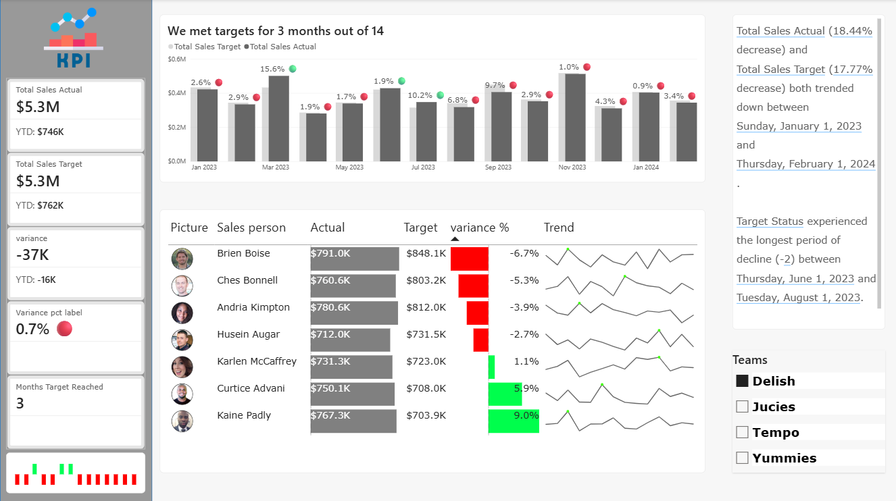

# 💰 Sales KPI Dashboard | Power BI

An interactive **Sales KPI Dashboard** built in **Power BI** to monitor sales performance against targets, track key financial KPIs, and provide actionable insights for business decision-making.

This project demonstrates the use of **Power BI, Power Query, DAX, data modeling, and interactive visualizations** to transform raw sales data into an insightful performance dashboard.

---

## 📌 Project Overview

The objective of this project was to build a Sales dashboard that enables businesses to monitor sales performance, compare actual sales against targets, identify high and low performers, and analyze sales trends over time.

The dashboard provides a centralized view of important financial KPIs that help management quickly assess business performance and make data-driven decisions.

---

## 🎯 Business Questions Answered

This dashboard answers the following business questions:

- What are the Total Sales Actual and Total Sales Target?
- What is the Year-to-Date (YTD) Actual and Target Sales?
- What is the overall sales variance?
- What is the sales variance percentage?
- How many months met the sales target?
- Which salespersons exceeded their targets?
- Which salespersons are below their targets?
- How has each salesperson's performance changed over time?
- Which teams are performing better?
- What are the key insights and trends identified automatically through Smart Narrative?

---

## 📷 Dashboard Preview

---
## 📊 Dashboard Features

### KPI Cards
- Total Sales Actual
- Total Sales Target
- YTD Actual Sales
- YTD Target Sales
- Sales Variance
- Variance %
- Months Target Achieved

### Performance Analysis
- Monthly Sales Actual vs Target
- Salesperson Performance Comparison
- Variance Percentage by Salesperson
- Individual Performance Trend (Sparklines)

### Interactive Features
- Team-wise Filtering
- Smart Narrative Insights
- Conditional Formatting for Positive & Negative Variance

---

## 🛠️ Tools & Technologies

- Power BI
- Power Query
- DAX (Data Analysis Expressions)
- Data Modeling
- Data Cleaning & Transformation
- Smart Narrative Visual
- Interactive Dashboard Design

---

## 📈 Key Insights

- Compare Actual Sales against Sales Targets in real time.
- Identify months where business targets were achieved.
- Analyze salesperson performance using variance and trend analysis.
- Track Year-to-Date sales performance.
- Quickly identify underperforming and high-performing sales representatives.
- Generate automated insights using Power BI Smart Narrative.

---

## 📂 Dashboard Components

### 1. KPI Overview
Displays:
- Total Sales Actual
- Total Sales Target
- Year-to-Date Sales
- Sales Variance
- Variance Percentage
- Target Achievement Count

### 2. Monthly Sales Performance
- Monthly Actual vs Target Comparison
- Monthly Variance Indicators

### 3. Salesperson Performance
- Actual Sales
- Target Sales
- Variance %
- Individual Trend Analysis

### 4. Smart Narrative
Automatically summarizes important business insights and highlights significant performance trends.

### 5. Team Filter
Allows users to analyze KPIs for specific sales teams.

## 📚 Skills Demonstrated

- Data Cleaning
- Data Transformation
- Data Modeling
- DAX Measures
- KPI Development
- Financial Data Analysis
- Sales Performance Analysis
- Interactive Dashboard Design
- Business Intelligence
- Data Storytelling

---

## 🚀 Future Improvements

- Profit & Margin Analysis
- Regional Sales Performance
- Product-wise Sales Analysis
- Customer Segmentation
- Forecasting with Time Intelligence
- Drill-through Reports
- Mobile Optimized Dashboard

---

## ⭐ If you found this project helpful, consider giving it a star!

If you have any suggestions or feedback, feel free to connect with me on LinkedIn.
